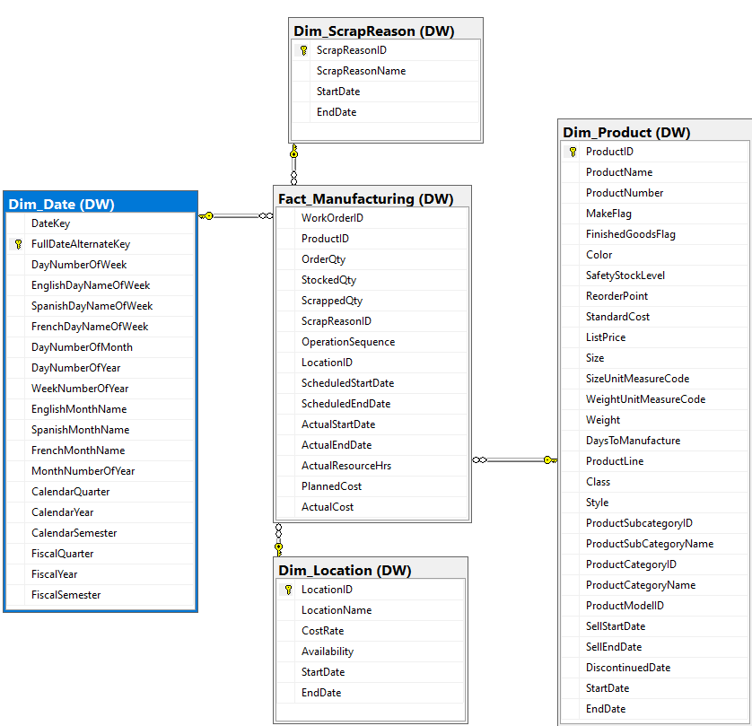

# AdventureWorks – Manufacturing BI & DSS (AdventureWorks2019)

**Author:**   
**Tech stack:** SQL Server, SSIS, SSAS, Power BI

This project builds a complete **Business Intelligence (BI)** solution for the **Manufacturing module** of the AdventureWorks bicycle company (Microsoft sample database, 2011–2014).  
It covers:

- Data warehouse design (star schema)
- ETL with SSIS (full & incremental loads)
- OLAP cube & KPIs with SSAS
- Interactive dashboards with Power BI
- Business insights & recommendations for production, quality, and performance

🔗 **Online dashboard:** (https://app.powerbi.com/view?r=eyJrIjoiOWFmYjFhNzAtZDhkZC00OGNiLWFmOTItMzI1YjE5MTc1ZTYwIiwidCI6IjI1ODRiOGI5LTU2MTctNDIwYi1hYTI0LWMyYTc4MDU2ZWNjMyIsImMiOjEwfQ%3D%3D)

📄**Full report (PDF):** see `docs/FinalProject_Manufacturing.pdf`

---

## 1. Business Context & Objectives

AdventureWorks is a global bicycle manufacturer (mountain, road, touring bikes and components).  
The manufacturing module faces typical challenges:

- Increasing production volume while keeping **cost** and **lead time** under control
- Controlling **scrap / waste** and improving product quality
- Ensuring **on-time production** to satisfy demand
- Monitoring **resource hours** and **location performance**

**Project goals:**

1. Build a Manufacturing **data mart** and BI architecture.
2. Define and track key **KPIs** for:
   - Production overview
   - Product quality control
   - Production performance control
3. Provide interactive dashboards for production managers to:
   - Identify bottlenecks
   - Control waste and delays
   - Support tactical and strategic decisions. :contentReference[oaicite:0]{index=0}

---

## 2. Data Description

Source: **AdventureWorks2019 – Production schema**, 2011–2014.

### 2.1. Source tables

*Figure 3 – Source system ERD (Production schema: WorkOrder, WorkOrderRouting, Product, Location, ScrapReason, etc.)*
- **Production.WorkOrder**
  - WorkOrderID, ProductID, OrderQty, ScrappedQty
  - StartDate, EndDate, DueDate
  - ScrapReasonID (link to scrap reason)

- **Production.WorkOrderRouting**
  - WorkOrderID, ProductID, OperationSequence
  - LocationID
  - ScheduledStartDate, ScheduledEndDate
  - ActualStartDate, ActualEndDate
  - ActualResourceHrs, PlannedCost, ActualCost

- **Production.Product**
  - ProductID, Name, ProductNumber
  - MakeFlag, FinishedGoodsFlag
  - Color, Size, Weight, DaysToManufacture
  - ProductSubcategoryID, ProductModelID
  - SellStartDate, SellEndDate, DiscontinuedDate

- **Production.ProductSubcategory, Production.ProductCategory**
  - Hierarchy for product category → subcategory → product.

- **Production.Location**
  - LocationID, LocationName
  - CostRate, Availability

- **Production.ScrapReason**
  - ScrapReasonID, ScrapReasonName, description of defect reasons.

---

### 2.2. Data warehouse (Star Schema)
 

*Figure 4 – Star schema for the Manufacturing data mart (Fact_Manufacturing + Dim_Product, Dim_Location, Dim_ScrapReason, Dim_Date)*
The manufacturing data mart is modeled as a **star schema** with:

- **Fact_Manufacturing**
  - WorkOrderID
  - ProductID (FK → Dim_Product)
  - ScrapReasonID (FK → Dim_ScrapReason)
  - LocationID (FK → Dim_Location)
  - DateKey (FK → Dim_Date)
  - OrderQty, StockedQty, ScrappedQty
  - OperationSequence
  - ScheduledStartDate, ScheduledEndDate
  - ActualStartDate, ActualEndDate
  - ActualResourceHrs
  - PlannedCost, ActualCost

- **Dim_Product**
  - ProductID, ProductName, ProductNumber
  - Color, Size, Weight
  - ProductLine, Class, Style
  - ProductSubcategoryID, ProductModelID
  - SubCategoryName, CategoryName
  - StandardCost, ListPrice
  - SellStartDate, SellEndDate, DiscontinuedDate
  - SCD attributes: StartDate, EndDate for slowly changing product info

- **Dim_Location**
  - LocationID, LocationName
  - CostRate, Availability
  - StartDate, EndDate (SCD)

- **Dim_ScrapReason**
  - ScrapReasonID, ScrapReasonName
  - StartDate, EndDate (SCD)

- **Dim_Date**
  - DateKey (int, surrogate)
  - FullDateAlternateKey
  - DayNumberOfWeek, EnglishDayNameOfWeek
  - DayNumberOfMonth, DayNumberOfYear
  - WeekNumberOfYear
  - MonthNumberOfYear, EnglishMonthName
  - CalendarQuarter, CalendarYear, CalendarSemester
  - FiscalQuarter, FiscalYear, FiscalSemester

---

## 3. ETL Process (SSIS)

*Figure 5 – Overall ETL control flow for Manufacturing data mart*
The ETL layer is implemented with **SQL Server Integration Services (SSIS)**.

### 3.1. Dimension ETL

*Figure 6 – Sample SSIS Data Flow for Dim_Product (Merge Join + SCD)*
Common steps:

1. **Extract** from source tables using **OLE DB Source**.
2. **Sort** by business key (e.g., ProductID, LocationID).
3. Use **Data Conversion** where types differ (e.g., Availability to float).
4. Apply **Slowly Changing Dimension (SCD)** to track changes over time.
5. **Load** into Dim tables using OLE DB Destination.

Specific notes:

- **Dim_Location**
  - Source: `Production.Location`
  - Convert `Availability` to float.
  - SCD to capture changes in cost rate / availability.

- **Dim_Product**
  - Sources: `Production.ProductCategory`, `Production.ProductSubcategory`, `Production.Product`
  - Use **Merge Join** to combine Category–Subcategory–Product hierarchy.
  - SCD handles changes in product attributes (price, category, etc.).

- **Dim_ScrapReason**
  - Source: `Production.ScrapReason`
  - Simple SCD, mainly type-1 changes.

- **Dim_Date**
  - Generated using a T-SQL calendar script (no direct source table).
  - Loaded via SSIS into Dim_Date.

### 3.2. Fact ETL – Fact_Manufacturing

*Figure 7 – SSIS Data Flow for Fact_Manufacturing (Lookup + Conditional Split)*
Two strategies:

1. **Full Load**
   - Used initially.
   - `Truncate` Fact_Manufacturing.
   - Load all joined data from `WorkOrder` + `WorkOrderRouting` into the fact table.

2. **Incremental Load**
   - Used for regular updates.
   - Use **Lookup** to check if a row already exists in Fact_Manufacturing.
   - Handle nulls in LocationID or ScrapReasonID with **Conditional Split**.
   - Use **OLE DB Command** to update existing rows or insert new ones.

This design supports both historical tracking and efficient daily loading.

---

## 4. KPIs & Data Analysis

### 4.1. Key KPIs

1. **Fiscal YTD – Production**
   - `TotalProduction = SUM(StockedQty)` per fiscal year.
   - Measures total quantity produced.

2. **Completion Rate**
   - `CompletionRate = StockedQty / OrderQty`
   - Measures production efficiency and ability to fulfill orders.

3. **Fiscal YTD – Resource Hours**
   - `ResourceHours = SUM(ActualResourceHrs)` per year.
   - Shows total labor / machine hours used.

4. **Fiscal YTD – Waste**
   - `WasteCost = SUM(ScrappedQty * StandardCost)`
   - Monetary value of scrapped products.

5. **Waste Percent**
   - `WastePercent = (Total ScrappedQty / Total OrderQty) * 100`

6. **Average Production Lead Time**
   - `LeadTime = AVG(ActualEndDate - ActualStartDate)` by product / subcategory.

7. **Cost Variance**
   - `CostVariance = ActualCost - PlannedCost`
   - Positive → over budget; negative → under budget.

8. **On-time Production Rate**
   - `OnTimeRate = % of work orders where ActualEndDate <= ScheduledEndDate`.

---

## 5. Main Findings (Summary of analysis)

### 5.1. Production volume & trend

- Total yearly production (all products):
  - **2011:** 6,045 units  
  - **2012:** 15,459 units  
  - **2013:** 27,652 units (peak)  
  - **2014:** 17,975 units (drop vs. 2013, still higher than 2011–2012)  
- Interpretation:
  - Strong growth up to 2013 (expansion, higher demand, or better efficiency).
  - Drop in 2014 suggests demand changes, capacity issues, or strategic shift.

### 5.2. Inventory & locations

- **Subassembly**: 95,477 units (≈29% of inventory)
- **Miscellaneous Storage**: 83,173 units (≈25%)
- **Tool Crib**: 72,899 units (≈22%)

These three locations hold **>75%** of total inventory, and Subassembly is the most critical buffer.  

### 5.3. Production & delay by location

- Subassembly has:
  - Highest production quantity
  - Highest production days
  - Highest overdue days
- Overdue days are strongly correlated with high production days, especially mid-month, indicating **capacity or scheduling bottlenecks** in busy periods.

### 5.4. Finished goods & sales

- Finished Goods Storage holds **17,319** units, with 152 products ready for sale.
- Top ready-for-sale items (324 units each):  
  `Half-Finger Gloves`, `Mountain Pump`, `Road Bottle Cage`, `Short-Sleeve Classic Jersey`, `Sport-100 Helmet`, `Women’s Tights`.

- Sales:
  - **274,914 orders** for **266 products**
  - Total revenue ≈ **$109.8M**
  - Best-selling product: **Mountain-200 Black, 38** – **2,977 orders**, **$4.4M** revenue.

### 5.5. Quality & scrap

- Scrap is concentrated in a **small set of reasons and locations** (Top-5 reasons, Top-5 locations).
- These hotspots drive most of the **Waste Cost** KPI, making them priority targets for improvement.

### 5.6. Lead time & performance

- Some product subcategories have **longer average lead times** and **lower on-time delivery rate**.
- Overdue production is again strongest in **Subassembly** and specific high-volume subcategories.
- Cost variance is positive in several operations → actual cost > planned cost, indicating inefficiencies or poor estimation.

---

## 6. Dashboards (Power BI)

*Figure  – Power BI dashboard: Production Overview*

*Figure  – Power BI dashboard: Production Quality Control*

*Figure  – Power BI dashboard: Production Performance Control*
The project provides three main dashboards for the **Production Manager**:

1. **Production Overview**
   - Fiscal YTD Production by year and product.
   - Cumulative monthly production.
   - Component & bike quantity (Pareto charts).
   - On-time vs. late work orders.

2. **Production Quality Control**
   - Scrap quantity & waste cost over time.
   - Top 5 scrap reasons.
   - Top 5 scrapped product types.
   - Scrap by location and product subcategory.

3. **Production Performance Control**
   - Average lead time (days) by product subcategory.
   - Lead time and order quantity by year.
   - Late vs. on-time rate across subcategories.
   - Cost variance overview (planned vs. actual).

The dashboards allow slicing by **year**, **product category/subcategory**, **location**, and **scrap reason**.

---

## 7. How to Run This Project Locally

1. Restore the **AdventureWorks2019** database on SQL Server.
2. Create the **Manufacturing_DW** schema using scripts from `sql/`.
3. Open SSIS packages in `ssis/` and run:
   - Dimension ETL (Dim_Product, Dim_Location, Dim_ScrapReason, Dim_Date)
   - Fact ETL (Fact_Manufacturing – Full or Incremental load)
4. Deploy SSAS cube from `ssas/` and process it.
5. Open `powerbi/Dashboard.pbix`:
   - Connect to SSAS cube or DW tables
   - Refresh data if needed.

---

## 8. Business Recommendations

### 8.1. Short-term actions

1. **Focus on top scrap reasons & locations**
   - Deep-dive into the Top-5 scrap reasons and Top-5 locations driving waste.
   - Introduce additional **quality checks** at these stations.
   - Update work instructions / quick re-training for operators on failure modes.

2. **Stabilize Subassembly**
   - Adjust shift planning and overtime for Subassembly during mid-month peaks.
   - Re-balance load to other locations where possible.
   - Prioritize **critical orders** to improve On-time Production rate.

3. **Tighten planning for high-value products**
   - Products like **Mountain-200 Black** bring high revenue; ensure better capacity planning and stricter quality control.
   - Monitor KPIs (lead time, scrap, cost variance) specifically for top-revenue SKUs.

4. **Improve estimation of planned cost**
   - For operations with large **positive cost variance**, review standard cost assumptions.
   - Quickly update routing standards and labor times to reflect reality.

5. **Introduce weekly KPI review**
   - Simple routine: every week the Production Manager checks:
     - Completion Rate
     - Waste Percent
     - On-time Production Rate
   - Use dashboard to identify anomalies early.

### 8.2. Long-term actions

1. **Capacity & layout redesign for Subassembly**
   - Use historical data (resource hours, lead time, overdue days) to simulate different layouts.
   - Consider **additional machines** or re-organizing the line to remove bottlenecks.

2. **Predictive maintenance**
   - Combine machine downtime logs with ActualResourceHrs to build a **predictive maintenance** model.
   - Goal: reduce unplanned downtime, especially during high-load mid-month.

3. **Standardization & continuous improvement program**
   - Use scrap & delay data to run structured **root cause analysis (5 Why, Fishbone)**.
   - Establish continuous improvement projects (Kaizen) on:
     - Scrap reduction
     - Setup time reduction
     - Standardized work at critical locations.

4. **Advanced demand & capacity planning**
   - Integrate sales forecasts with production planning to smooth the mid-month peaks.
   - Align inventory policies (safety stock at Subassembly) with actual variability.

5. **BI as an ongoing capability**
   - Expand this manufacturing data mart to include **Purchasing**, **Inventory**, and **Sales** for end-to-end visibility.
   - Promote self-service BI so line managers can track their own KPIs.

---

## 9. Portfolio Notes (for Recruiters)

This project demonstrates:

- **Data modeling**: dimensional modeling, star schema, bus matrix.
- **ETL engineering**: SSIS, SCD handling, incremental loading.
- **Analytics**: KPI definition, EDA, interpreting trends for production/quality/performance.
- **Visualization**: Interactive Power BI dashboards with clear narratives for managers.
- **Business thinking**: Translating numbers into concrete short-term and long-term actions.

Feel free to clone this repo and explore the ETL packages, cube design and Power BI dashboards.
